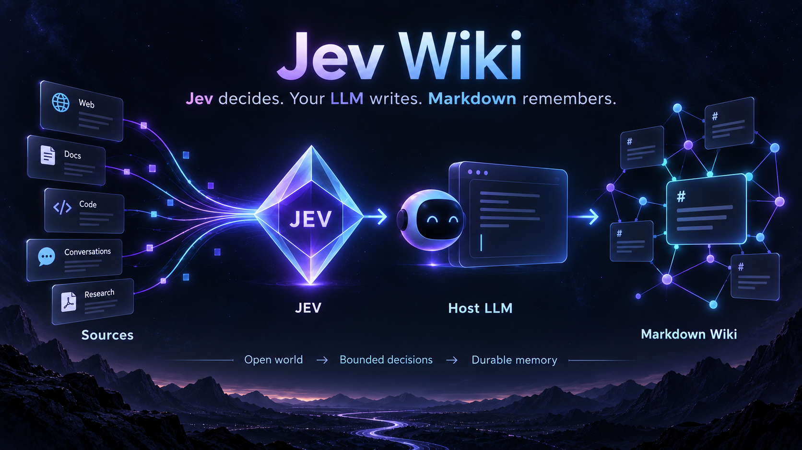
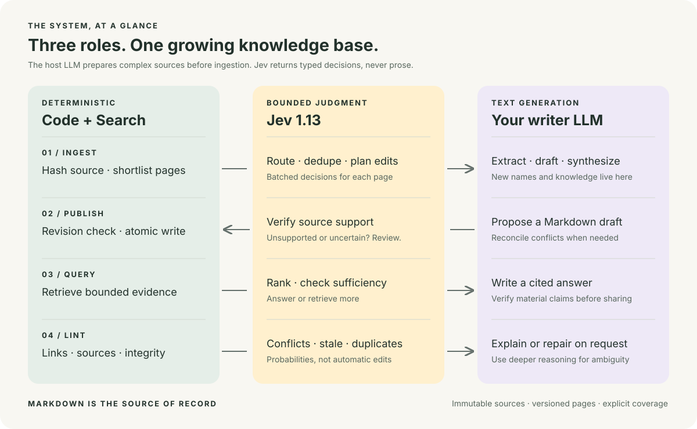

<div align="center">

# Jev Wiki
### Jev decides. Your LLM writes. Markdown remembers.

**A small wiki skill. A clear division of intelligence.**

[Get started](#get-started) · [Architecture](#architecture) · [Technical design](references/technical-design.md) · [Operations](references/operations.md) · [Evidence](references/evaluation.json)

</div>



> **Jev + a writer LLM + deterministic code.**
> Jev cannot write summaries or answers. Your host agent supplies the LLM.

| Code & search | Jev · OpenRouter | Your LLM |
| :--- | :--- | :--- |
| Files, hashes, candidates | Route, rank, deduplicate | Read, extract, summarize |
| Links, revisions, index | Verify, flag conflicts, abstain | Draft, synthesize, explain |

## Architecture



```text
OPEN WORLD                  BOUNDED DECISIONS                DURABLE MEMORY
LLM discovers knowledge  →  Jev selects the next action  →  Code commits Markdown
```

**[Read the technical design →](references/technical-design.md)** Ingest planning, retrieval, decision gates, storage, and extension boundaries.

## Get started

**Python 3.11+ · macOS / Linux · OpenRouter key · a skill-capable coding agent**

```bash
# Private repository: access required. No pip install.
gh repo clone JayYun98/jev-wiki ~/.codex/skills/jev-wiki

# Use OPENROUTER_API_KEY or the existing ~/.codex/global.env.
# Start a fresh agent session, then:
```

```text
Use $jev-wiki to build a wiki from these documents.
Verify every draft. Keep citations. Spend under $0.01.
```

<details>
<summary><strong>Prefer the CLI?</strong></summary>

```bash
python3 scripts/jev_wiki.py init ./vault
python3 scripts/jev_wiki.py ingest ./vault examples/refund-policy.md
# Host LLM drafts → publish verifies and commits.
python3 scripts/jev_wiki.py query ./vault "What is the refund window?"
python3 scripts/jev_wiki.py lint ./vault --semantic
```

[Complete draft → publish walkthrough](references/operations.md#complete-cli-walkthrough).
</details>

## Small surface. Real safeguards.

```text
sources/     immutable evidence     SHA-256 integrity
wiki/        readable Markdown     source-backed pages
.jev-wiki/   machine bookkeeping    index · history · cache · usage

✓ Atomic publication       ✓ Expected-revision checks
✓ Explicit uncertainty     ✓ Current-price budget preflight
✓ No automatic retries     ✓ No silent evidence truncation
```

**No server. No database. No runtime dependencies.**

## Show the work

```bash
python3 -m unittest discover -s tests -v   # offline
python3 scripts/evaluate.py --budget 0.04  # opt-in, synthetic only
```

**11 live checks · 10 paid requests · $0.000347172** in the latest captured smoke run.
English + Korean contradictions, semantic duplicates, evidence gates, and abstention.
[Captured results](references/evaluation.json) · [Security boundaries](SECURITY.md)

<sub>A small smoke evaluation—not a production accuracy claim. Writer-LLM costs excluded. Source/draft limit: 16 KB; decision payload: 28 KB. Retrieval and pair checks are bounded, with explicit coverage. Defaults need domain calibration. See the operating contract for budgets, recovery, and limits.</sub>

---

<sub>Independent implementation inspired by the LLM Wiki pattern. Not affiliated with Jev, TypeSafe, OpenRouter, or other wiki projects. Private repository.</sub>
