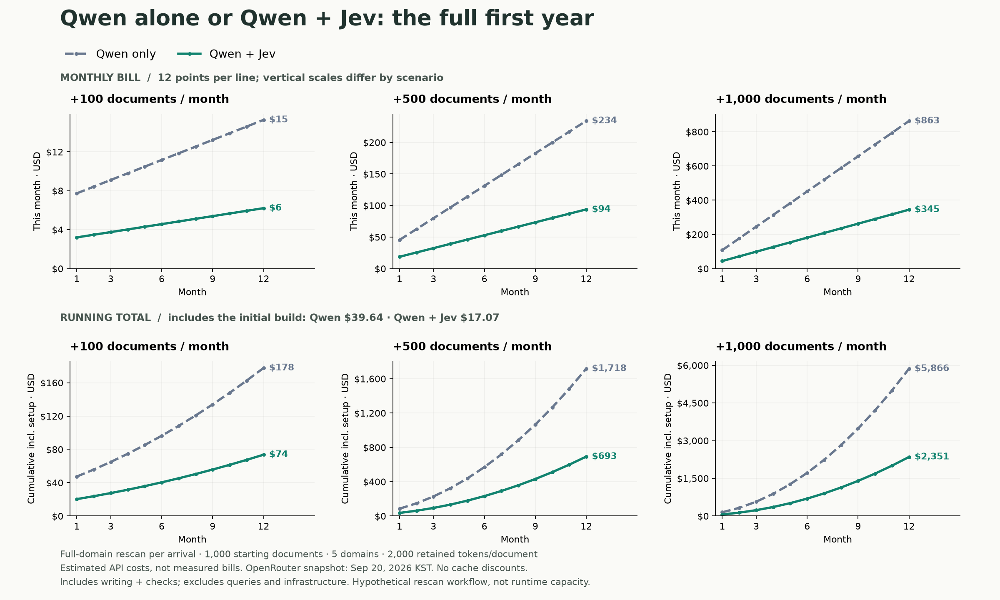

<div align="center">

# Jev Wiki
### Jev decides. Your LLM writes. Markdown remembers.

**A small wiki skill. A clear division of intelligence.**

[Get started](#get-started) · [Architecture](#architecture) · [Technical design](references/technical-design.md) · [Operations](references/operations.md) · [Estimated cost](#estimated-cost) · [Evidence](references/evaluation.json)

</div>


> **Jev + a writer LLM + deterministic code.**
> Jev cannot write summaries or answers. Your host agent supplies the LLM.

## Same wiki idea. Different division of work.

```text
KARPATHY'S LLM WIKI PATTERN              JEV WIKI

Source + wiki + schema                 Source + wiki + skill
           │                                      │
           ▼                                      ▼
┌───────────────────────────┐          ┌───────────────────────────┐
│ LLM agent orchestrates    │          │ HOST LLM                  │
│                           │          │ Read · extract new claims │
│ Read and understand       │          └─────────────┬─────────────┘
│ Find relevant pages       │                        ▼
│ Decide what to update     │          ┌───────────────────────────┐
│ Notice contradictions     │          │ CODE / SEARCH             │
│ Write summaries / answers │          │ Hash · shortlist pages    │
│ Maintain links and index  │          └─────────────┬─────────────┘
│ Coordinate wiki upkeep    │                        ▼
└─────────────┬─────────────┘          ┌───────────────────────────┐
              │                        │ JEV                       │
              │                        │ Where to edit? New page?  │
              │                        │ Duplicate? Conflict?      │
              │                        │ Relevant? Enough evidence?│
              │                        └─────────────┬─────────────┘
              │                                      ▼
              │                        ┌───────────────────────────┐
              │                        │ HOST LLM                  │
              │                        │ Summarize · revise · answer│
              │                        └─────────────┬─────────────┘
              │                                      ▼
              │                        ┌───────────────────────────┐
              │                        │ JEV → CODE                │
              │                        │ Verify → publish → index  │
              │                        └─────────────┬─────────────┘
              ▼                                      ▼
       Markdown wiki                          Markdown wiki
```

Simplified responsibility comparison with [Karpathy's LLM Wiki pattern](https://gist.github.com/karpathy/442a6bf555914893e9891c11519de94f), which also allows search and custom tools. This is not a performance benchmark.

| Work | Jev Wiki owner |
| :--- | :--- |
| Where to edit? Duplicate? Conflict? Enough evidence? | **Jev** |
| New concepts, summaries, synthesis, final answers | **Host LLM** |
| Retrieval, hashes, links, revisions, index | **Code** |

### One source → several page decisions

```text
New policy: “Refunds within 30 days”
                   │
          CODE: shortlist pages
                   │
          JEV: one shared request
           ┌───────┼──────────────┐
           ▼       ▼              ▼
      Policy     FAQ           Billing
      update     conflict      keep
           │       │              └── No edit
           ▼       ▼
      HOST LLM: draft / investigate
                   │
          JEV: verify source support
                   │
          CODE: publish each page
```

Illustrative plan, not a captured model result. A conflict requires review before editing.
[What moves to Jev?](references/technical-design.md#what-moves-to-jev) · [Full ingest diagram](references/technical-design.md#the-original-proposal-llm--jev-ingestion) · [Batched page decisions](references/technical-design.md#fan-out-batch-the-judgments-then-write)

## Architecture


```text
OPEN WORLD                  BOUNDED DECISIONS                DURABLE MEMORY
LLM discovers knowledge  →  Jev selects the next action  →  Code commits Markdown
```

**[Read the technical design →](references/technical-design.md)** Ingest planning, retrieval, decision gates, storage, and extension boundaries.

## Get started

**Python 3.11+ · macOS / Linux · OpenRouter key · a skill-capable coding agent**

```bash
# Private repository: access required. No pip install.
gh repo clone JayYun98/jev-wiki ~/.codex/skills/jev-wiki

# Use OPENROUTER_API_KEY or the existing ~/.codex/global.env.
# Start a fresh agent session, then:
```

```text
Use $jev-wiki to build a wiki from these documents.
Verify every draft. Keep citations. Spend under $0.01.
```

<details>
<summary><strong>Prefer the CLI?</strong></summary>

```bash
python3 scripts/jev_wiki.py init ./vault
python3 scripts/jev_wiki.py ingest ./vault examples/refund-policy.md
# Host LLM drafts → publish verifies and commits.
python3 scripts/jev_wiki.py query ./vault "What is the refund window?"
python3 scripts/jev_wiki.py lint ./vault --semantic
```

[Complete draft → publish walkthrough](references/operations.md#complete-cli-walkthrough).
</details>

## Small surface. Real safeguards.

```text
sources/     immutable evidence     SHA-256 integrity
wiki/        readable Markdown     source-backed pages
.jev-wiki/   machine bookkeeping    index · history · cache · usage

✓ Atomic publication       ✓ Expected-revision checks
✓ Explicit uncertainty     ✓ Current-price budget preflight
✓ No automatic retries     ✓ No silent evidence truncation
```

**No server. No database. No runtime dependencies.**

## Estimated cost

**Qwen3.8 Flash alone vs Qwen3.8 Flash + Jev.** Both include extraction, writing, and verification, assuming a full model-based rescan of the relevant domain on every arrival.

Start with **1,000 documents across five domains**, then add **100 / 500 / 1,000 per month**. The chart shows monthly and cumulative API costs over the first year.



<sub>Illustrative estimate: 2,000 retained tokens/document; OpenRouter prices checked September 20, 2026. Excludes queries, caching discounts, and infrastructure. Full rescanning is a costing scenario, not current runtime behavior.</sub>

## Show the work

```bash
python3 -m unittest discover -s tests -v   # offline
python3 scripts/evaluate.py --budget 0.04  # opt-in, synthetic only
```

**11 live checks · 10 paid requests · $0.000347172** in the latest captured smoke run.
English + Korean contradictions, semantic duplicates, evidence gates, and abstention.
[Captured results](references/evaluation.json) · [Security boundaries](SECURITY.md)

<sub>A small smoke evaluation—not a production accuracy claim. Writer-LLM costs excluded. Source/draft limit: 16 KB; decision payload: 28 KB. Retrieval and pair checks are bounded, with explicit coverage. Defaults need domain calibration. See the operating contract for budgets, recovery, and limits.</sub>

---

<sub>Independent implementation inspired by the LLM Wiki pattern. Not affiliated with Jev, TypeSafe, OpenRouter, or other wiki projects. Private repository.</sub>
