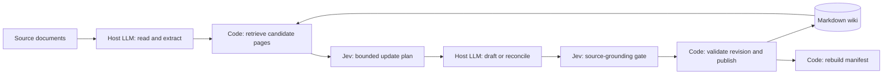

# Technical design: a hybrid LLM wiki

[← README](../README.md) · [Operating contract and CLI](operations.md)

Jev Wiki separates knowledge generation from bounded decisions and deterministic file operations. The host LLM discovers and explains knowledge; Jev chooses among explicit alternatives; Python retrieves evidence and maintains the vault.

This document develops the supplied LLM Wiki/Jev design proposal into an implementation-oriented specification. **Current behavior** describes this repository. **Extensions** describe possible future work, not shipped capabilities.

## 1. Responsibility boundaries



| Responsibility | Owner | Contract |
| --- | --- | --- |
| Discover entities, concepts, and claims | Host LLM | Produce focused source text and new names |
| Retrieve existing page candidates | Code/search | Return a bounded shortlist and coverage |
| Select route, page type, and affected pages | Jev | Return typed choices over supplied alternatives |
| Draft summaries, revisions, synthesis, and answers | Host LLM | Preserve source scope, dates, and uncertainty |
| Check draft support and semantic relationships | Jev | Return probabilistic decisions, with review paths |
| Store sources, validate links, publish revisions | Python | Enforce deterministic integrity constraints |
| Resolve ambiguous contradictions | Host LLM, optionally a stronger reasoner | Investigate evidence and propose a revised draft |

The boundary is **open-ended generation versus closed-set judgment**. Jev can choose `concept` from a page-type list; it cannot invent the concept's name or write its explanation. It can flag conflicting claims; explaining or reconciling them requires the host LLM.

The CLI does not call a writer model. The skill-capable host agent provides that model and follows [SKILL.md](../SKILL.md). `writer_role` is a handoff hint, not an automatic model switch.

## 2. Decision interface

The runtime sends HTTPS requests to OpenRouter's Decisions endpoint with model `typesafe/jev-1.13`:

```text
POST https://openrouter.ai/api/alpha/decisions
{ model, state, questions }
                  ↓
{ answers, usage, ... }
```

`state` contains bounded evidence. `questions` defines independently named judgments over that shared evidence. Source and page text are explicitly treated as untrusted data, never as instructions.

| Primitive | Meaning | Current use |
| --- | --- | --- |
| Choice | Select one supplied label | Ingest route, target page, page type, per-page action, grounding, page relationship |
| Noul | Probability that a proposition is true | Evidence sufficiency, semantic duplication, embedded hostile instructions |
| Score | Relevance against an ordered rubric | Query candidate ranking, from 0 to 3 |

Noul is a yes-probability, not a severity score. Choice/Score confidence is an additional review signal; missing confidence is treated as zero. The client validates answer types, label membership, and numeric ranges before decisions reach callers.

Initial policy thresholds are `confidence=0.85`, `support=0.90`, and `risk=0.10`. These are configurable starting points, not measured accuracy guarantees.

## 3. Ingest: one source, several page decisions

1. The host LLM reads complex material and prepares focused Markdown inputs. Original documents and extraction provenance should be preserved by the host; this CLI stores the supplied text, not a PDF parser's original input.
2. Code hashes the source. An identical stored source returns `already_ingested` without inference. `--reassess` explicitly requests another plan after interrupted work.
3. Code selects up to six existing pages using lexical overlap, including CJK bigrams, within an evidence byte budget.
4. One Jev request evaluates the shared source and candidates using the following question set.

| Question | Allowed results |
| --- | --- |
| `route` | `create`, `update`, `duplicate`, `skip`, `review` |
| `target` | A supplied candidate label or `none` |
| `page_type` | `source`, `entity`, `concept`, `synthesis` |
| `edit_pN`, one per candidate | `keep`, `update`, `conflict`, `link`, `review` |
| `injection` | Noul probability |

With six candidates, this is ten questions in one request. The application batches judgments; it does not issue one inference request per candidate or assume a fixed provider latency benefit.

5. Low route confidence, excessive injection risk, or an uncertain target for an update/duplicate routes the plan to review. A confident per-page conflict also requires review. Uncertain per-page actions remain explicitly marked `review`.
6. The source is stored immutably after a successful decision. **Ingest does not edit wiki pages.**
7. The host drafts the necessary pages, publishes each through its own gate, then rebuilds the index and runs lint.

```text
Source + candidates A, B, C
             │
             ▼
        One Jev request
             │
             ├── A: update  → host drafts → verify → publish A
             ├── B: keep    → no edit
             └── C: review  → host investigates before editing
```

Multiple page updates are independent publications, not an atomic batch. A failed page does not roll back earlier successful pages. New-page and duplicate decisions are provisional when candidate coverage is incomplete.

## 4. Retrieval precedes judgment

Jev evaluates the candidates it receives; it does not search the vault. Sending the entire wiki on every operation would increase cost and consume the context budget without solving candidate selection.

Current retrieval scans authoritative Markdown pages, ranks lexical overlap, and passes selected full pages. It reports total/selected page counts and whether all pages were included. Oversized evidence is rejected or excluded with coverage information; it is not silently truncated.

```text
All pages → lexical shortlist → Jev judgment → host LLM context
```

For larger vaults, BM25, qmd, or vector retrieval could replace the shortlist step. These are extensions, not installed dependencies. Retrieval quality must be evaluated separately from Jev's ranking quality: a reranker cannot recover a fact omitted by retrieval.

## 5. Query: rank, assess, then generate

A query returns evidence and a route, not a generated answer:

```text
Question → retrieve candidates → Jev relevance + sufficiency
                                      │
                        ┌─────────────┴─────────────┐
                        ▼                           ▼
                     answer                   retrieve_more
                        │                           │
              Host writes with citations    Search other sources
                        │                    or acknowledge the gap
              Verify material claims
              against immutable sources
```

Each candidate receives a 0–3 relevance score: unrelated, related but missing the requested facts, partially answering, or fully answering. The `answer` route requires at least one candidate scoring 2 or higher with sufficient confidence, plus a sufficiency probability meeting the support threshold.

The sufficiency question checks whether the selected pages jointly provide explicit, mutually consistent evidence. `retrieve_more` does not mean the requested fact is false. The host must cite page IDs and source hashes, and verify material answer drafts against the original stored sources.

Automatically deciding whether an answer deserves a permanent wiki page is a possible extension. Current query operations do not save answers.

## 6. Publication is a separate gate

```text
Host draft + source IDs + expected revision
                   │
        Validate title and links
        Reject stale target revision
                   │
        Jev: supported / contradicted /
             insufficient_evidence
        Jev: injection probability
                   │
          accepted? ── no → review; no page write
                   │ yes
        Recheck revision and constraints
        Save prior revision → atomic replacement
```

Acceptance requires `supported` with confidence at least `support`, and injection probability at most `risk`. This checks grounding in the supplied sources, not independent truth.

Code checks immutable source hashes, page identifiers, source references, and existing wikilink targets. Expected revisions protect against overwriting a page changed during verification. Previous revisions are retained before atomic replacement. A vault-wide advisory lock coordinates CLI commands; external editors do not participate in that lock.

## 7. Lint: structural checks before semantic checks

| Layer | Implemented checks | Outcome |
| --- | --- | --- |
| Python | Invalid page metadata, invalid/missing sources, broken wikilinks, pages without inbound links | Deterministic findings |
| Jev, opt-in | Contradictions, possible supersession, semantic duplication | Bounded probabilistic findings |
| Host LLM | Explanation, source investigation, proposed reconciliation | A draft that must pass publication again |

Semantic lint selects page pairs with shared terms or explicit links, strongest overlap first. It checks at most four pairs by default and reports candidate, checked, oversized, and total pair counts. Pair candidate scoring is currently O(n²); larger vaults may need an inverted index.

A disagreement alone is insufficient to call a page stale. A Jev supersession result additionally needs exactly one distinct valid ISO date in each page, strictly ordered in the claimed direction. Otherwise it becomes `review`. This date guard is conservative; it does not independently establish the semantic meaning of those dates.

Lint never automatically deletes, merges, or rewrites pages. Topic coverage analysis, missing cross-reference suggestions, and manifest completeness checks from the broader proposal are not implemented lint features.

## 8. Markdown and the machine manifest

```text
sources/<sha256>.md                 immutable supplied evidence
wiki/<page-id>.md                   readable content + source metadata
.jev-wiki/index.json                disposable machine manifest
.jev-wiki/history/<page>/<hash>.md  previous page revisions
.jev-wiki/cache/                    short-lived decision cache
.jev-wiki/usage.jsonl               request reservations and charges
.jev-wiki/config.json               thresholds and candidate limit
```

`index VAULT` rebuilds a manifest containing page IDs, titles, source hashes, revision hashes, and outgoing links. Markdown remains authoritative. **The current retriever reads pages directly; it does not use the manifest to reduce inference input.**

A richer manifest could include summaries, entity aliases, claim records, effective dates, and page types. Those fields would require provenance and synchronization rules before becoming reliable retrieval inputs. They are intentionally outside the current implementation. Git backup/commit operations remain the user's or host agent's responsibility.

## 9. Cost and operational boundaries

- Sources/drafts are limited to 16 KB; serialized decision requests to 28 KB. Verification accepts 1–8 source IDs, subject to the request limit.
- Before uncached inference, the client reads current endpoint pricing and reserves a full 32,000-token input cost. Changed context limits or nonzero completion pricing stop execution for review.
- Reported `usage.cost` reconciles the reservation. Unknown outcomes retain a possible charge. There are no automatic retries or automatic fallback model calls.
- Cache keys include model, full state, and questions; entries expire after one hour.
- Budgets apply per command/client. The host must track cumulative session spending, including unresolved reservations. Writer-LLM spending is separate.

The [captured synthetic evaluation](evaluation.json) reports 11 checks and 10 paid requests at $0.000347172 for that run. It is a smoke test, not a production accuracy benchmark, throughput guarantee, or comparison with an all-LLM baseline. Model-wide marketing speedups and historical price claims are not used as project guarantees.

## 10. Extension boundary

| Proposal | Current implementation | Add only when needed |
| --- | --- | --- |
| Batched multi-page planning | Up to six candidate pages in one request | Larger retrieval sets with explicit batching and coverage |
| Search → Jev → writer | Lexical search and Jev ranking | BM25/hybrid retrieval after measuring misses |
| Machine-readable wiki state | Rebuildable page/link manifest | Provenance-backed entity/claim indexes |
| Writer/reasoner routing | Host handoff hint | Explicit model selection and separate budgets |
| Durable answer capture | Host can deliberately draft and publish | A tested save-worthiness decision |
| Automated maintenance | Read-only lint plus verified publication | Explicitly authorized repair workflows |

The architectural objective is to reduce repeated generative-model decisions about where and whether to edit, while retaining that model for understanding and writing. Actual savings depend on retrieval quality, page size, update fan-out, review frequency, and writer usage.

## Implementation map and background

- [CLI workflows](../scripts/jev_wiki.py): ingest, query, verification, publication, lint, index.
- [Decisions client](../scripts/decisions.py): typed responses, authentication, budgets, caching, usage records.
- [Storage](../scripts/storage.py): integrity, retrieval, locking, revisions, atomic writes.
- [Operating contract](operations.md): runnable commands, failure handling, recovery, and API documentation links.

The supplied design discussion referenced the following background material. Its broader proposals are separated above from this repository's implemented behavior:

- [Karpathy's LLM Wiki notes](https://gist.github.com/karpathy/442a6bf555914893e9891c11519de94f)
- [Community LLM Wiki implementation](https://github.com/wpzero/karpathy-llm-wiki)
- [TypeSafe's introduction to Jev](https://typesafe.ai/blog/introducing-system-one-models-and-jev)
- [LangChain: Building a Harness with Jev](https://www.langchain.com/blog/building-a-harness-with-jev)
